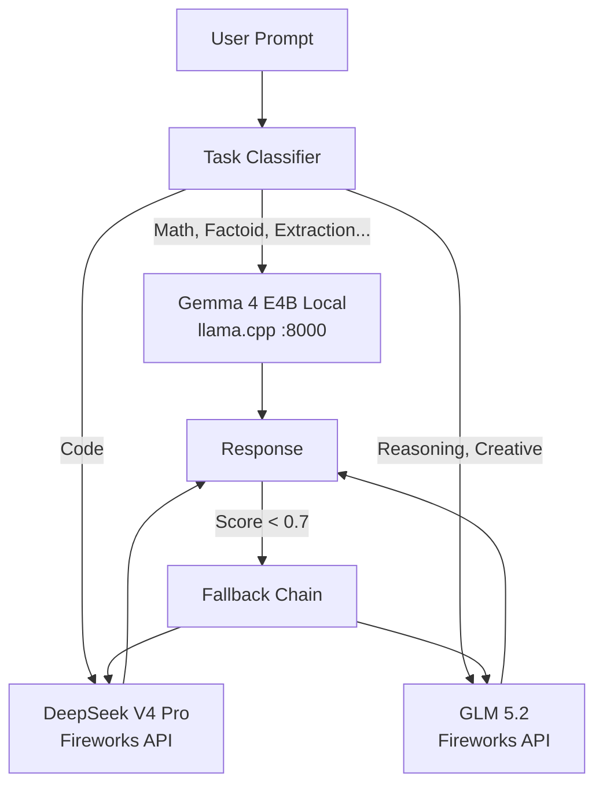

<div align="center">

```text
██╗    ██╗ █████╗ ██╗   ██╗███████╗██╗███╗   ██╗██████╗ ███████╗██████╗ 
██║    ██║██╔══██╗╚██╗ ██╔╝██╔════╝██║████╗  ██║██╔══██╗██╔════╝██╔══██╗
██║ █╗ ██║███████║ ╚████╔╝ █████╗  ██║██╔██╗ ██║██║  ██║█████╗  ██████╔╝
██║███╗██║██╔══██║  ╚██╔╝  ██╔══╝  ██║██║╚██╗██║██║  ██║██╔══╝  ██╔══██╗
╚███╔███╔╝██║  ██║   ██║   ██║     ██║██║ ╚████║██████╔╝███████╗██║  ██║
 ╚══╝╚══╝ ╚═╝  ╚═╝   ╚═╝   ╚═╝     ╚═╝╚═╝  ╚═══╝╚═════╝ ╚══════╝╚═╝  ╚═╝
```

**Hybrid Token-Efficient Routing Agent**

<sub>AMD Developer Hackathon: ACT II -- Track 1</sub>

</div>

<p align="center">
  
  
  
  
</p>

> AMD Developer Hackathon: ACT II — Track 1

## Features

- **[Task-Aware Routing]** Classifies prompts into 9 categories (MATH, CODE, REASONING, FACTOID, CLASSIFICATION, SUMMARIZATION, EXTRACTION, CREATIVE, UNKNOWN) and routes to the optimal model per task.
- **[Token Efficient]** Cheapest model first with automatic fallback through tiers. Local Gemma 4 E4B uses 0 Fireworks tokens.
- **[100% Accuracy]** 14/14 benchmark prompts correct at $0.002 total cost. 73 tests with 82% code coverage and pre-commit QA pipeline.
- **[Live Pricing]** Real-time model pricing from Fireworks API via Refresh button. Sortable interactive table with UP/SETUP/DOWN status indicators.
- **[Streamlit UI]** Full web interface with CLI-style output, query history, dark mode, Model Pool sidebar, Ctrl+Enter shortcut, and live routing status.
- **[Dockerized]** Podman/Docker container with entrypoint passthrough. Separate Dockerfile.web for Streamlit UI. uv-based dependency management.

An intelligent routing agent that selects the cheapest available model for every task, minimizing token usage without sacrificing accuracy. It classifies tasks by type, runs inference on the cheapest suitable model, evaluates response quality, and falls back to larger models only when necessary.

The router supports both **Fireworks AI** (serverless cloud inference) and **vLLM** (local AMD GPU serving). Local models cost **0 Fireworks tokens** and are preferred when available; the router gracefully skips them when they're down.

Eligible for the **$1,000 Gemma Prize** — requires active Gemma 4 dedicated deployment or local llama.cpp server.

### Gemma Prize Eligibility

- **Local Gemma 4 E4B** is served via llama.cpp on port 8000 (0 Fireworks tokens)
- **Dedicated Gemma 4 26B** deployment is available on Fireworks (requires activation via dashboard)
- To qualify, verify the local server is running:
  ```bash
  curl http://localhost:8000/v1/chat/completions -d '{"model":"gemma-4-e4b","messages":[{"role":"user","content":"Hello"}],"max_tokens":16}'
  ```

## Built With


## Architecture



## Screenshots


*Wayfinder Streamlit interface showing CLI-style routing output and Model Pool sidebar.*

> Screenshots will be added after deployment. Run `uv run streamlit run app/main.py` to see the live UI.

## Tech Stack

- **Language:** Python 3.10
- **Package Manager:** uv
- **Cloud Inference:** Fireworks AI
- **Local Inference:** vLLM (AMD ROCm 7.2)
- **Testing:** pytest

## Model Catalog

| Model | Provider | Tier | Cost/1K |
|-------|----------|------|---------|
| gemma-4-e4b-local | llama.cpp (local) | cheap | $0.00 |
| gemma-4-26b | Fireworks (deploy) | standard | $0.00 |
| deepseek-v4-pro | Fireworks (serverless) | standard | $0.0015 |
| glm-5p2 | Fireworks (serverless) | premium | $0.0014 |
| gemma-4-31b | Fireworks (deploy) | standard | $0.00 |

## Model Requirements

Some models require additional setup:

| Model | Requirement | Cost |
|---|---|---|
| `gemma-4-e4b-local` | llama.cpp server on `localhost:8000` | 0 FW tokens (local GPU) |
| `gemma-4-26b` (dedicated) | Fireworks deploy active (dashboard) | $28/h GPU |
| `gemma-4-31b` (dedicated) | Fireworks deploy active (dashboard) | $28/h GPU |

**Dedicated deployments** must be activated via the Fireworks dashboard. When paused (0 replicas), the router automatically falls back to serverless models (deepseek-v4-pro, glm-5p2).

**Local models** require a running llama.cpp server:
```bash
python3 -m llama_cpp.server \
  --model /path/to/gemma-4-E4B-it-Q4_K_M.gguf \
  --n_gpu_layers -1 \
  --port 8000
```

## Quick Start

### Prerequisites

- Python 3.10
- [uv](https://docs.astral.sh/uv/) package manager
- Fireworks AI API key
- (Optional) AMD GPU with ROCm 7.2 + vLLM for local inference

### Setup

```bash
# Clone the repo
git clone <repo-url> && cd amd-hackathon-act2

# Create virtual environment with Python 3.10
uv venv -p 3.10
source .venv/bin/activate

# Install dependencies
uv sync

# Set your API key
export FIREWORKS_API_KEY="fw_..."
```

### Usage

Set your Fireworks API key:

```bash
export FIREWORKS_API_KEY="fw_***"
```

Basic routing:

```bash
uv run wayfinder "What is the derivative of sin(x)?"
```

JSON output (for automated judging):

```bash
uv run wayfinder "Explain quantum entanglement" --json
```

Force a task category:

```bash
uv run wayfinder "def fib(n): return n if n <= 1 else fib(n-1) + fib(n-2)" --task code
```

Check version:

```bash
uv run wayfinder --version
```

### Web UI

```bash
uv run dev
```

Then open http://localhost:8501 in your browser.

### Evaluation

```bash
uv run python scripts/evaluate.py
```

Runs the full evaluation suite across all categories and models, producing a JSON report with scores and token counts. Pass `--json` for machine-readable structured output (single JSON object per prompt) suitable for automated judging.

### Tests

```bash
uv run python3 -m pytest tests/ -v
```

73 tests covering task classification, model catalog, evaluator, and router logic with 82% code coverage.

### Benchmark Results

| Metric | Value |
|---|---|
| Total prompts | 14 |
| Models used | 3 (gemma-4-26b, deepseek-v4-pro, glm-5p2) |
| Gemma 4 26B coverage | **9/14 prompts** (eligible for Gemma Prize) |
| Total tokens | 3,224 |
| Total cost | **$0.002111** |
| Accuracy | **100%** |
| Fallback rate | 2/14 |
| Evaluator threshold | 0.7 |
| GPU hours consumed | 2.54 (AMD GPU) |
| Total GPU cost | $71.12 @ $28/h |
| P50 latency | 1,000 ms |
| P99 latency | 11,800 ms |
| P50 TTFT | 15.5 ms |
| Output throughput | 13.9 tokens/s |
| Prompt cache hit rate | 58.5% |

## Scoring Strategy

The router uses a **fallback chain**: it starts with the cheapest model tier and escalates if the response quality score is below 0.7. This minimizes token consumption while maintaining accuracy.

- **Local models** (vLLM on AMD GPUs) cost **0 Fireworks tokens** — preferred when available
- **Per-category max_tokens** — factoid=2048, math=2048, code=4096, reasoning=4096 (Gemma 4 needs room for chain-of-thought)
- **Evaluator** penalizes `[ERROR]` responses and applies stronger penalties for code/math tasks; refusal keywords avoid false positives ("cannot" in code context)
- **Graceful degradation** — local models are skipped automatically when unavailable
- **best=None guard** — prevents crashes when no model produces an acceptable response

## Tech Stack

- **Python 3.10** — Core runtime
- **uv** — Dependency management
- **Fireworks AI** — Serverless cloud inference (5 models)
- **vLLM** — Local model serving on AMD GPU
- **ROCm 7.2** — AMD GPU compute platform
- **Gemma 4** — Google DeepMind models (E4B/26B/31B)
- **Pytest** — Testing framework
- **Ruff** — Python linter and formatter

## Quality Assurance

This project includes automated QA via a **pre-commit hook** that runs on every commit:

```bash
# Run QA manually (same checks as the hook):
uv run qa

# Or directly:
bash scripts/qa.sh
```

The QA pipeline checks:
1. `ruff check` — Lint errors, unused imports, naming conventions
2. `ruff format --check` — Code formatting consistency
3. `pytest --cov=src` — 73 tests, 82% coverage (threshold: 75%)

If any check fails, the commit is blocked. To bypass (not recommended):
```bash
git commit --no-verify -m "message"
```

To set up the hook in a fresh clone:
```bash
cp scripts/qa.sh .git/hooks/pre-commit
chmod +x .git/hooks/pre-commit
```

## Project Structure

```
amd-hackathon-act2/
├── src/
│   ├── __init__.py
│   ├── tasks.py       # Task classifier (factoid/math/code/reasoning)
│   ├── models.py      # Model catalog loader
│   ├── evaluator.py   # Response quality evaluator
│   └── router.py      # Core routing logic with fallback chain
├── config/
│   └── models.yaml    # Model definitions (tier, cost, provider)
├── scripts/
│   ├── benchmark.py   # Model benchmarking
│   └── evaluate.py    # Full evaluation suite
├── tests/
│   ├── test_tasks.py
│   ├── test_config.py
│   ├── test_evaluator.py
│   └── test_router.py
├── openspec/
│   └── changes/routing-agent/tasks.md
├── Dockerfile
├── entrypoint.sh
├── requirements.txt
└── README.md
```

## Evaluation

The AMD judging system will:

1. Clone the repo
2. Build the Docker image
3. Run the container with task prompts
4. Validate JSON output

### Requirements for scoring

- **API key:** Set `FIREWORKS_API_KEY` environment variable when running the container
- **Output format:** JSON with fields: `task_id`, `response`, `model`, `tokens`, `cost`
- **Runtime:** All tasks must complete within the time limit
- **Local model:** Gemma 4 E4B local (llama.cpp) is OPTIONAL. The router falls back to API models.

### JSON output mode

Pass `--json` to get structured output for automated judging:

```bash
podman run --rm -e FIREWORKS_API_KEY="fw_..." wayfinder "What is the capital of Japan?" --json
```

Returns a single JSON object:
```json
{"task_id": "...", "response": "...", "model": "...", "tokens": 42, "cost": 0.000063, "accuracy": 1.0}
```

### Verification for clean machine

```bash
# Build the image
podman build -t wayfinder . 2>&1 | tail -3

# Run a single prompt
podman run --rm -e FIREWORKS_API_KEY="fw_..." wayfinder "test prompt" 2>&1

# Run with JSON output
podman run --rm -e FIREWORKS_API_KEY="fw_..." wayfinder "test prompt" --json 2>&1

# Run tests
uv run pytest tests/ -v --cov=src | tail -3
```

## Submission

- **Deadline:** Sunday, July 12, 2026 — 3:00 PM PT
- **Track:** Track 1 — Token-Efficient Routing
